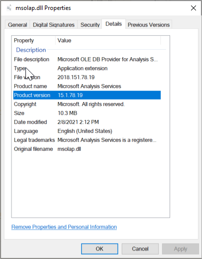
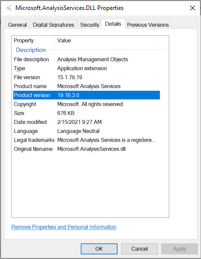
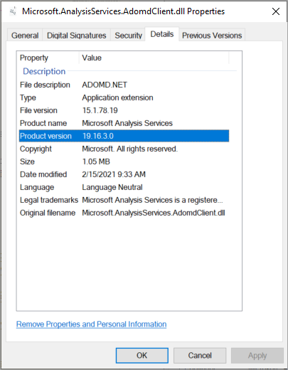

# Analysis Services client libraries

[!INCLUDE[ssas-appliesto-sqlas-all-aas-pbip](includes/ssas-appliesto-sqlas-all-aas-pbip.md)]

Client libraries are necessary for client applications and tools to connect to Analysis Services. Microsoft client applications like Power BI Desktop, Excel, SQL Server Management Studio (SSMS), and Analysis Services projects extension for Visual Studio install all three client libraries and update them along with regular application updates. Custom client applications also require client libraries are installed. Client libraries are updated monthly. Before downloading, be sure to see [Known issues](#known-issues).

## Download the latest

### Windows Installer  

|Download  | Version  |
|---------|---------|
|[MSOLAP (amd64)](https://go.microsoft.com/fwlink/?linkid=829576)    |    15.1.78.19     |
|[MSOLAP (x86)](https://go.microsoft.com/fwlink/?linkid=829575)     |     15.1.78.19        |
|[AMO](https://go.microsoft.com/fwlink/?linkid=829578)     |   19.16.3     |
|[ADOMD](https://go.microsoft.com/fwlink/?linkid=829577)     |    19.16.3      |

### NuGet packages

Analysis Services Management Objects (AMO) and ADOMD client libraries are available as installable packages from [NuGet.org](https://www.nuget.org/). It's recommended you migrate to NuGet references instead of using Windows Installer.

Starting June 2020, *preview* versions of [.NET Core](/dotnet/core/about) packages equivalent to the AMO and ADOMD client packages are also available. Preview versions have some limitations. To learn more, see [Known issues](#known-issues) later in this article.

NuGet package assemblies AssemblyVersion follow semantic versioning: MAJOR.MINOR.PATCH. NuGet references load the expected version even if there is a different version in the GAC (resulting from MSI install). PATCH is incremented for each release. AMO and ADOMD versions are kept in-sync.

#### AMO and ADOMD

|Package  | Version  |
|---------|---------|
|[AMO](https://www.nuget.org/packages/Microsoft.AnalysisServices.retail.amd64/)    |    19.16.3      |
|[ADOMD](https://www.nuget.org/packages/Microsoft.AnalysisServices.AdomdClient.retail.amd64/)     |   19.16.3       |

#### AMO and ADOMD .Net Core 

|Package  | Version  |
|---------|---------|
|[AMO](https://www.nuget.org/packages/Microsoft.AnalysisServices.NetCore.retail.amd64)    |    19.16.3      |
|[ADOMD](https://www.nuget.org/packages/Microsoft.AnalysisServices.AdomdClient.NetCore.retail.amd64)     |   19.16.3        |

## Known issues

#### AMO and ADOMD .Net Core (Preview)

- Features in preview should not be used in a production environment. Certain functionality, support, and documentation is limited. Refer to the [Microsoft Online Services Terms (OST)](https://www.microsoft.com/licensing/product-licensing/products?rtc=1) for details.

- There has been limited performance and stress testing done for the public preview.

#### 19.14.0 and higher - AMO and ADOMD .Net Core (Preview)

Version 19.14.0 of the .Net Core client libraries introduces preview support for Self-Contained publishing (both in a published directory, and in single-file mode), as well as support for consumption by .NET 5.0 projects. A number of issues related to connectivity to SQL Server Analysis Services that were identified in the previous release have been fixed.

#### 19.12.7.2 and higher - AMO and ADOMD .Net Core (Preview)

Version 19.12.7.2 of the .Net Core client libraries introduces preview support for SQL Server Analysis Services. Lower preview versions only supported Azure Analysis Services and Power BI datasets.

#### 19.12.3.0 - AMO

This release introduces a new enumeration, **Microsoft.AnalysisServices.DataType**. However, the previous enumeration, **Microsoft.AnalysisServices.Tabular.DataType** still exists. If your code references the previous enumeration simply as **DataType** in a code file with statements to both namespaces (**Microsoft.AnalysisServices**, **Microsoft.AnalysisServices.Tabular**), due to the ambiguity, you could get an error when compiling. To resolve the error, fully qualify the reference to the enumeration.

## Understanding client libraries

Analysis Services utilizes three client libraries. ADOMD.NET and Analysis Services Management Objects (AMO) are managed client libraries. And Analysis Services OLE DB Provider (MSOLAP DLL) is a native client library. Typically, all three are installed at the same time.

Microsoft client applications like Power BI Desktop and Excel install all three client libraries and update them when new versions are available. Depending on the version or frequency of updates, some client libraries may not be the latest versions required by Azure Analysis Services and Power BI. The same applies to custom applications or other interfaces such as AsCmd, TOM, ADOMD.NET. These applications require manually or programmatically installing the libraries. The client libraries for manual installation are included in SQL Server feature packs as distributable packages. However, these client libraries are tied to the SQL Server version and may not be the latest. Make sure you always install the latest, downloadable from this article.  

### Client library types

#### Analysis Services OLE DB Provider (MSOLAP)

 Analysis Services OLE DB Provider (MSOLAP) is the native client library for Analysis Services database connections. It's used indirectly by both ADOMD.NET and AMO, delegating connection requests to the data provider. You can also call the OLE DB Provider directly from application code.  
  
 The Analysis Services OLE DB Provider is installed automatically by most tools and client applications used to access Analysis Services databases. It must be installed on computers used to access Analysis Services data.  
  
 OLE DB providers are often specified in connection strings. An Analysis Services connection string uses a different nomenclature to refer to the OLE DB Provider: MSOLAP.\<version>.dll.

#### AMO  

 AMO is a managed client library used for server administration and data definition. It's installed and used by tools and client applications. For example, SQL Server Management Studio (SSMS) uses AMO to connect to Analysis Services. A connection using AMO is typically minimal, consisting of `"data source=\<servername>"`. After a connection is established, you use the API to work with database collections and major objects. Both Visual Studio and SSMS use AMO to connect to an Analysis Services instance.  

#### ADOMD

 ADOMD.NET is a managed data client library used for querying Analysis Services data. It's installed and used by tools and client applications.
  
 When connecting to a database, the connection string properties for all three libraries are similar. Almost any connection string you define for ADOMD.NET by using  [Microsoft.AnalysisServices.AdomdClient.AdomdConnection.ConnectionString](/dotnet/api/microsoft.analysisservices.adomdclient.adomdconnection.connectionstring#Microsoft_AnalysisServices_AdomdClient_AdomdConnection_ConnectionString) also works for AMO and the Analysis Services OLE DB Provider (MSOLAP). To learn more, see [Connection string properties](instances/connection-string-properties-analysis-services.md).

## Check installed versions

### OLEDDB (MSOLAP)  

1. Go to `C:\Program Files\Microsoft Analysis Services\AS OLEDB\`. If you have more than one folder, choose the higher number.
1. Right-click **msolap.dll** > **Properties** > **Details**. Check the **Product version** property. Note: If the filename is msolap140.dll, it's older than latest version and should be upgraded.

    

### AMO

1. Go to `C:\Windows\Microsoft.NET\assembly\GAC_MSIL\Microsoft.AnalysisServices\`. If you have more than one folder, choose the higher number.
1. Right-click **Microsoft.AnalysisServices** > **Properties** > **Details**.  

    

### ADOMD

1. Go to `C:\Windows\Microsoft.NET\assembly\GAC_MSIL\Microsoft.AnalysisServices.AdomdClient\`. If you have more than one folder, choose the higher number.
1. Right-click **Microsoft.AnalysisServices.AdomdClient** > **Properties** > **Details**.  

    

## Manually update

Client libraries are typically installed and updated automatically along with tools and client applications that use them. However, in some cases client libraries may not be updated automatically and each must be manually updated. To update manually, download and run the Windows Installer (.msi) package for each client library.

### To download and update

1. Click:
    - [Download MSOLAP (amd64)](https://go.microsoft.com/fwlink/?linkid=829576) or [Download MSOLAP (x86)](https://go.microsoft.com/fwlink/?linkid=829575)
    - [Download AMO](https://go.microsoft.com/fwlink/?linkid=829578)
    - [Download ADOMD](https://go.microsoft.com/fwlink/?linkid=829577)

1. In **Downloads**, click a Windows Installer Package to run Setup.
1. In Setup, click **Next**.
1. Read the license agreement. If you agree, select **I accept the terms in the license agreement**, and then click **Next**.
1. Click, **Install**.
1. When completed, click **Finish**.
