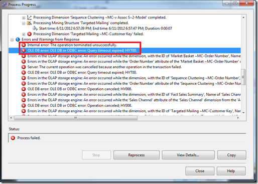
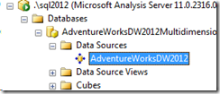
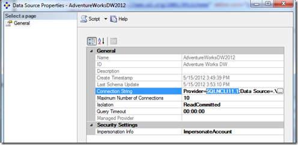
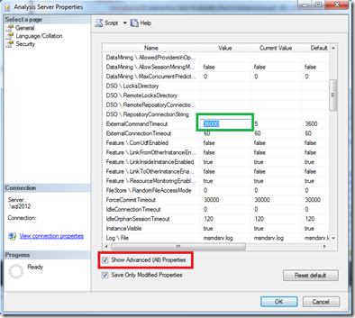
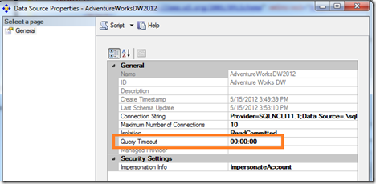

# Troubleshoot the Analysis Services error "OLE DB error: OLE DB or ODBC error: Operation canceled; HY008"

This article describes background troubleshooting information and specific steps for one error that can occur when you use SQL Server Analysis Services when you process multi-dimensional models.

> [!NOTE]
> This article is derived from a blog posted on June 11, 2012, and might contain dated material.

## Errors during processing

Analysis Services processing might fail with this error:
`OLE DB error: OLE DB or ODBC error: Operation canceled; HY008.`

In SQL OLE DB terms, `HY008` means `DB_E_CANCELED`, which suggests that the query was canceled purposefully by the caller. At times, you can see this error better from SQL Server Management Studio:

```Error output
Internal error: The operation terminated unsuccessfully.
OLE DB error: OLE DB or ODBC error: Query timeout expired;HYT00.
Errors in the OLAP storage engine: An error occurred while the dimension, with the ID of '<Some ID>', Name of '<Dimension Name>' was being processed.
```



`HYT00` means `DB_E_ABORTLIMITREACHED (0x80040E31)` or a timeout expired. The timeout expired due to the SQL_QUERY_TIMEOUT setting. The command timeout or query timeout kicked in to kill the running query and cancel the work.

### XMLA equivalent command and errors

If you use XMLA commands to process your Analysis Services objects, the syntax might resemble the following example:

```XMLA
<Batch xmlns="http://schemas.microsoft.com/analysisservices/2003/engine">
    <Parallel>
        <Process xmlns:xsd="http://www.w3.org/2001/XMLSchema" xmlns:xsi="http://www.w3.org/2001/XMLSchema-instance" xmlns:ddl2="http://schemas.microsoft.com/analysisservices/2003/engine/2" xmlns:ddl2_2="http://schemas.microsoft.com/analysisservices/2003/engine/2/2" xmlns:ddl100_100="http://schemas.microsoft.com/analysisservices/2008/engine/100/100" xmlns:ddl200="http://schemas.microsoft.com/analysisservices/2010/engine/200" xmlns:ddl200_200="http://schemas.microsoft.com/analysisservices/2010/engine/200/200" xmlns:ddl300="http://schemas.microsoft.com/analysisservices/2011/engine/300" xmlns:ddl300_300="http://schemas.microsoft.com/analysisservices/2011/engine/300/300">
            <Object>
                <DatabaseID>AdventureWorksDW2012Multidimensional-EE</DatabaseID>
            </Object>
            <Type>ProcessFull</Type>
            <WriteBackTableCreation>UseExisting</WriteBackTableCreation>
        </Process>
    </Parallel>
</Batch>
```

When a timeout occurs, the system shows a list of different errors appended in a long string. One or several of the database connections have a timeout, but you might not notice. There's significant noise in the error that the multiple connections get from a cancellation notification. Analysis Services reports the errors in a seemingly random order due to the multi-threaded nature of the processing implementation. The timeout indicator is hard to see.

```output
Internal error: The operation terminated unsuccessfully. Internal error: The operation terminated unsuccessfully. Server: The current operation was cancelled because another operation in the transaction failed. Internal error: The operation terminated unsuccessfully. OLE DB error: OLE DB or ODBC error: **Communication link failure; 08S01; Shared Memory Provider: No process is on the other end of the pipe.
; 08S01.** Errors in the OLAP storage engine: An error occurred while the dimension, with the ID of 'Dim Time', Name of 'Date' was being processed. Errors in the OLAP storage engine: An error occurred while the 'Fiscal Year' attribute of the 'Date' dimension from the 'AdventureWorksDW2012Multidimensional-EE' database was being processed. OLE DB error: OLE DB or ODBC error: Communication link failure; 08S01; Shared Memory Provider: No process is on the other end of the pipe.
```

To understand this output, `08S01` means `DB_E_CANNOTCONNECT` from the provider. This HResult is a bit of a misnomer. It could be that the system can't connect or that it's been disconnected or canceled by the provider or the server if the query was canceled.

Check the `OLAP\Log\Msmdsrv.log` file. You might get the error message in case your application didn't log it.

```msmdsrv.log
(6/12/2012 4:52:21 PM) Message:  (Source: [\\?\C:\OLAP\Log\msmdsrv.log](file://\\?\C:\OLAP\Log\msmdsrv.log), Type: 3, Category: 289, Event ID: 0xC1210003)
(6/12/2012 4:52:21 PM) Message: OLE DB error: OLE DB or ODBC error: Operation canceled; HY008. (Source: [\\?\C:\OLAP\Log\msmdsrv.log](file://\\?\C:\OLAP\Log\msmdsrv.log), Type: 3, Category: 289, Event ID: 0xC1210003)
(6/12/2012 4:52:22 PM) Message: OLE DB error: OLE DB or ODBC error: Operation canceled; HY008. (Source: [\\?\C:\OLAP\Log\msmdsrv.log](file://\\?\C:\OLAP\Log\msmdsrv.log), Type: 3, Category: 289, Event ID: 0xC1210003)
(6/12/2012 4:52:24 PM) Message: OLE DB error: OLE DB or ODBC error: Operation canceled; HY008. (Source: [\\?\C:\OLAP\Log\msmdsrv.log](file://\\?\C:\OLAP\Log\msmdsrv.log), Type: 3, Category: 289, Event ID: 0xC1210003)
(6/12/2012 4:45:33 AM) Message: OLE DB error: OLE DB or ODBC error: Operation canceled; HY008. (Source: [\\?\C:\OLAP\Log\msmdsrv.log](file://\\?\C:\OLAP\Log\msmdsrv.log), Type: 3, Category: 289, Event ID: 0xC1210003)
```

The preceding log output indicates that the OLE DB provider reported an error, hex code `0xC1210003`.

### Attempt to simplify the error

If you're unable to determine which specific object and attribute are causing the problem, simplify the processing parallelism by restricting the number of connections to the relational database.

In **Solution Explorer**, select your **Data Source** properties. Adjust **Maximum number of connections** from a value of 10 to a value of 1. The next time you process the objects, any failure might show the problem attributes better and a more exact error description.

## Background on cube processing

When Analysis Services processes a cube or a lower-level object like a dimension or measure group, it sends many large SQL queries to the relational database engine through an OLE DB provider. For example, `SELECT * FROM DimTABLE1, SELECT * FROM FactTable1`.

These processing queries can take from minutes to hours to run. The length of time depends on how many joins there are and how large the tables and partitions are. The number of joins is dependent entirely on your cube design, and your dimension and measure group relationships in the design.

To connect to the relational data source, there are connection strings stored in the cube design to point to the data warehouse in the database server.



This is a connection string that gets saved into the Analysis Services database design. It can point to SQL Server, or it can point to other third-party relational databases, such as Teradata and Oracle. In the following screenshot, the SQL Server 2012 OLE DB provider named **SQLNCLI11.1** is shown.



## Background on command and connection timeouts

Whenever a command such as a T-SQL query in the case of SQL Server is issued to the data source, the command timeout property is set by the Analysis Services caller.

The following example shows ADO pseudo code to show how a command timeout is set by the code that runs Analysis Services internally:

```pseudocode
conn1.Open();
command = conn1.CreateCommand();
command.CommandText = "Select * from DimTable";
command.CommandTimeout = 15;
```  

In the preceding example, if 15 seconds pass and the query hasn't yet finished, the OLE DB provider cancels the query on behalf of the caller. The caller doesn't have to keep any timer because the timeout is set in the provider layer. But if the query fails, the caller doesn't really know how long it took and if it was a timeout or not.

In OLE DB terms, this property is called **DBPROP_COMMANDTIMEOUT** on the **DBPROPSET_ROWSET** object. This property lets you run queries for a certain amount of time. If the command doesn't finish, it's canceled. In SQL Server, you can see such timeouts with an Attention event in the profiler trace. In that profiler trace, the event duration exactly matches the duration of the command timeout.

The command timeout setting isn't set on the connection or the connection string itself. It must be set after a connection is established, as each command object is used. There's a similar connection timeout, `DBPROP_INIT_TIMEOUT` on the `DBPROPSET_DBINIT` object. In Analysis Services, the connection timeout is the separate property **ExternalConnectionTimeout**. This setting is applicable for making initial contact with the server and checking the authentication and authorization of accounts. This setting doesn't affect long-running queries typically, because the initial connection was successful without failure.

You can control the OLE DB command timeout in Analysis Services. There's an **ExternalCommandTimeout** setting in the advanced options on the Analysis Services instance. The default value is 60 mins (one hour).   That timeout value might not be long enough. This default configuration allows any one T-SQL query to the relational database to last one hour or more. After that point, the command is canceled by the OLE DB provider used to connect to that system, and the Analysis Services processing command fails.

The [ExternalCommandTimeout](https://docs.microsoft.com/sql/analysis-services/server-properties/general-properties?view=sql-server-2017?preserve-view=true) integer property defines the timeout, in seconds, for commands issued to external servers, which includes relational data sources and external Analysis Services servers.
The default value for this property is 3,600 seconds.

If you expect the processing queries to take more than one hour, raise the timeout higher than one hour. In one example, the processing join queries took around nine hours to complete on a 2-TB database with some large complex joins.

Right-click the server name in **Management Studio** > **Properties**. Select the **Show Advanced (All) Properties** check box. Then adjust the **ExternalCommandTimeout** setting, as shown in the following images:




Now when the server runs external queries to talk to the relational database, it sets the command timeout to the value specified so that it can run a long time without failure.

## Long processing duration can lead to timeouts

If processing queries takes more than an hour, there might be ways to tune the system to perform faster:

- Tune the joins that Analysis Services does when it runs all those processing queries in the background on your behalf.
- Partition your measurement groups so that the unit of work done by processing is a smaller chunk of data rather than all the data at once. Partitioning requires careful thought and cube design work. If your data has more than 20 million rows in a table and you see processing performance problems, consider partitioning.

## Tune the relational database system

After you run the cube processing once or twice, look for missing indexes in the relational database or data warehouse system. Take a few minutes to tune the database. Add some indexes to the relational data warehouse tables to help tune the join criteria to process the cube.

The following T-SQL code is borrowed from the support tool PSSDiag. It identifies the most helpful missing indexes and works on SQL Server 2005 and later. Find the indexes on the fact and dimension tables that help improve the performance the most. Remember that while adding an index might help read performance like cube processing, it might slow some insert and update performance, such as extract, transform, load (ETL) activities.

```sql
PRINT 'Missing Indexes: ' PRINT 'The "improvement_measure" column is an indicator of the (estimated) improvement that might ' PRINT 'be seen if the index was created. This is a unitless number, and has meaning only relative ' PRINT 'the same number for other indexes. The measure is a combination of the avg_total_user_cost, ' PRINT 'avg_user_impact, user_seeks, and user_scans columns in sys.dm_db_missing_index_group_stats.' PRINT '' PRINT '-- Missing Indexes --' SELECT CONVERT (varchar, getdate(), 126) AS runtime, mig.index_group_handle, mid.index_handle, CONVERT (decimal (28,1), migs.avg_total_user_cost * migs.avg_user_impact * (migs.user_seeks + migs.user_scans)) AS improvement_measure, 'CREATE INDEX missing_index_' + CONVERT (varchar, mig.index_group_handle) + '_' + CONVERT (varchar, mid.index_handle) + ' ON ' + mid.statement + ' (' + ISNULL (mid.equality_columns,'') + CASE WHEN mid.equality_columns IS NOT NULL AND mid.inequality_columns IS NOT NULL THEN ',' ELSE '' END + ISNULL (mid.inequality_columns, '') + ')' + ISNULL (' INCLUDE (' + mid.included_columns + ')', '') AS create_index_statement, migs.*, mid.database_id, mid.[object_id] FROM sys.dm_db_missing_index_groups mig INNER JOIN sys.dm_db_missing_index_group_stats migs ON migs.group_handle = mig.index_group_handle INNER JOIN sys.dm_db_missing_index_details mid ON mig.index_handle = mid.index_handle WHERE CONVERT (decimal (28,1), migs.avg_total_user_cost * migs.avg_user_impact * (migs.user_seeks + migs.user_scans)) > 10 ORDER BY migs.avg_total_user_cost * migs.avg_user_impact * (migs.user_seeks + migs.user_scans) DESC PRINT '' GO
```

## Memory competition impact on timeouts

There are multiple reasons that timeouts might occur, and many include non-timeout scenarios. The second most common cause of a processing T-SQL query cancellation is out-of-memory failures.

There can be competition for memory between SQL Server Database Engine (SQLServr.exe), Analysis Services (MsMdsrv.exe), Integration Services packages (DTExec.exe or ISServerExec.exe), and Reporting Services running on the same machine. You might need to throttle back the other services or balance memory allocations. The most common adjustment is to limit the SQL Server **maximum server memory** setting.

Cube processing is like the most intensive processing time for a SQL Server used as a data warehouse, because  Analysis Services pushes several large queries with complex joins to the SQL relational database engine at the same time.

```sql
exec sp_configure 'show advanced',1;
reconfigure;
exec sp_configure 'min server memory';
exec sp_configure 'max server memory';
-- look at config_value in the results for the current MB setting configured
```

The ETL processes that typically run rarely benefit from the normal buffering of the SQL Server database engine's buffer pool. Consider SQL Server Integration Services (SSIS) packages that import large sets of data from a transactional system into a data warehouse system. ETL operations often use BULK INSERT commands that don't require much warm data in memory.

Other ETL operations during the ETL phase of building a data warehouse benefit from SQL's large buffer pool. The read (SELECT) and UPDATE and JOIN parts of the ETL processing, such as Lookups and slowly changing dimension updates, use cached warm data in memory, if available. Lowering the SQL Server Database Engine's memory might have a side effect on those parts of the ETL imports that usually go on just before cube processing.

Reading data from RAM is 1000-1million times faster than reading from your average spinning disk drive, so shrinking the SQL buffer pool means more disk reads. Unless you have high-end solid-state disks (SSDs) or a high-end SAN, you might wait a little more.

### Measure memory consumption in the system

If memory is the culprit, gather a profiler trace and these performance counters to better investigate the cause:

1. Set up the Windows **Performance Monitor** to produce a trace of resource consumption. Select **Start** > **Run** > **Perfmon**.

2. Right-click the **Counter Logs** icon in the tree under **Performance Logs**, and begin a new counter log. Name the log.

3. Add the counter for the following objects: *all* counters for each object, and *all* instances for each object.

   - Memory
   - MSAS* --- all objects (for a default instance of Analysis Services)
   - MSOLAP$InstanceName* --- all objects (for a named instance of Analysis Services)
   - MSSQL* --- all objects (for the SQL Server Database Engine)
   - Paging File
   - Process
   - Processor
   - System
   - Thread

4. Sample every 15 seconds.

5. On the **Log** tab, specify the directory and file name strategy as a **Binary File**.

6. To get the **Performance Monitor** to roll over to a new file once a day, on the **Schedule** tab, select:

   - **Stop log after:** *1 day*
   - **When the log file closes:** *Start a new log file*

### Review the Performance Monitor results

1. Look at the SQL Server engine's counter to see if **SQL Memory** > **Total Server Memory** was increasing out of control.

2. Look at the **Memory** > **Available MBytes** counter to see how much free memory was available to the processes running in Windows.

3. Look at **Process** > **Private Bytes** for the various executable processes to see how much each takes in comparison.

4. Look at the **MSAS** and **MSOLAP** counters. If the usage amount goes above the **High KB** amount,  Analysis Services has to trim some of the buffers in memory.

   - **Memory Usage KB**
   - **Memory Limit High KB**
   - **Memory Limit Low KB**
   - **Memory Limit Hard KB**

   If the **Memory Usage KB** amount exceeds the **Hard KB** limit, Analysis Services might cancel all current work and go into *panic mode* to kill off the memory consumers. Panic mode might manifest itself in similar errors, but usually the error is more descriptive, such as `The Operation Has been Cancelled` or `The session was canceled because it exceeded a timeout setting (session orphaned timeout or session idle timeout) or it exceeded the session memory limit.`

## Parallel processing impact on timeouts

Analysis Services processing commands can be run in parallel or sequentially. In the processing command syntax, check to see if you're specifying to run in sequential order or run in parallel. Check the SSIS package or XMLA job that runs the processing.

This image shows the settings for an SSIS Analysis Services processing task:


This example shows an XMLA command that runs up to eight tasks in parallel:

```xmla
<Batch xmlns="http://schemas.microsoft.com/analysisservices/2003/engine">
  <Parallel MaxParallel="8">
    <Process xmlns:xsd="http://www.w3.org/2001/XMLSchema" xmlns:xsi="http://www.w3.org/2001/XMLSchema-instance" xmlns:ddl2="http://schemas.microsoft.com/analysisservices/2003/engine/2" xmlns:ddl2_2="http://schemas.microsoft.com/analysisservices/2003/engine/2/2" xmlns:ddl100_100="http://schemas.microsoft.com/analysisservices/2008/engine/100/100" xmlns:ddl200="http://schemas.microsoft.com/analysisservices/2010/engine/200" xmlns:ddl200_200="http://schemas.microsoft.com/analysisservices/2010/engine/200/200" xmlns:ddl300="http://schemas.microsoft.com/analysisservices/2011/engine/300" xmlns:ddl300_300="http://schemas.microsoft.com/analysisservices/2011/engine/300/300">
      <Object>
        <DatabaseID>AdventureWorksDW2012Multidimensional-EE</DatabaseID>
      </Object>
      <Type>ProcessFull</Type>
      <WriteBackTableCreation>UseExisting</WriteBackTableCreation>
    </Process>
  </Parallel>
</Batch>
```

If the system is timing out, you might need to scale back the number of parallel tasks, especially when you manually override the default setting, **Let the server decide**.

You might be able to throttle the system better by reducing the **MaxThreads** configuration by 50% and reprocessing the objects so that fewer threads run at once.

In the worst case, run processing in **Sequential** mode to see if the errors go away. The system takes less memory to run a sequence of one task at a time rather than many tasks at once. The tradeoff might be that it runs longer because you can't push the system hardware to the same throughput limits. 

To learn more about processing best practices, see [SQL Server best practices](https://docs.microsoft.com/previous-versions/sql/sql-server-2005/administrator/cc966525(v=technet.10)).

For more information on the architecture of cube processing, see [Analysis Services 2005 processing architecture](https://docs.microsoft.com/previous-versions/sql/sql-server-2005/administrator/ms345142(v=sql.90)).

## Aggregation memory impact on timeouts

There's an advanced setting of **AggregationMemoryLimitMax**. For more information, see [this blog post](http://geekswithblogs.net/ManicArchitect/archive/2010/11/02/142558.aspx)

SQL Server Analysis Services uses memory quota to control the number of concurrent jobs. Each job calculates how much memory it needs to finish the job and requests the memory quota based on its estimate. The job proceeds only when the memory quota is granted. We estimate the quota for an aggregation job. The configuration settings that control the memory usage estimates are **AggregationMemoryLimitMin** and **AggregationMemoryLimitMax**.

To achieve more parallelism for processing, tune the settings.

## Additional timeout settings

**Query Timeout** is another setting on the data source. This setting seems not to apply readily to processing. This setting applies to the connection pool and helps to expire idle connections that are no longer needed. This setting doesn't apply to the commands that run during processing or ROLAP commands.



There are many other timeouts in Analysis Services, such as:

- **ForceCommitTimeout** for processing to kill user queries if MDX queries hold locks that block processing of commits.
- **CommitTimeout** for processing to give up if it gets blocked at the commit phase.
- **ServerTimeout** for queries to time out after some time.
- Connection pool settings, such as **IdleConnectionTimeout**, **IdleOrphanSessionTimeout**, **MaxIdleSessionTimeout**, **MinIdleSessionTimeout**, and **DatabaseConnectionPoolConnectTimeout**, and the ones we discussed previously, **ExternalConnectionTimeout** and **ExternalCommandTimeout**.

## Special characters

In some situations, the processing timeout error was due to some special characters present in the columns of one of the dimension tables. Even [null values](https://www.sqlservercentral.com/blogs/cube-processing-error-hy008) in a dimension column can cause processing failures.

You might isolate the problem better by processing each object one at a time until you find the problem.

For example, while processing the dimension table, it throws the error `OLE DB error: OLE DB or ODBC error: Operation canceled; HY008.`

After the user removed the special characters, processing worked as expected.

## Isolate to a partition

You might be able to further isolate the error to a specific partition. If you partitioned your cube, there might be a poorly performing query under one of the partitions.

Experiment with the partition query. Change from a direct **Named Query Table** in the **Data Source** view to an underlying SQL query instead.
