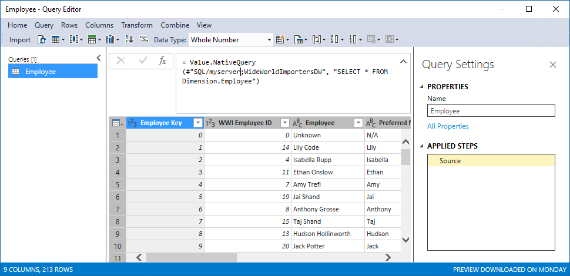
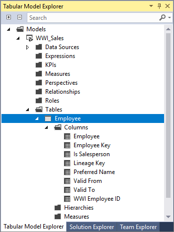

# Import data by using a native query
[!INCLUDE[ssas-appliesto-sql2017-later-aas](../../includes/ssas-appliesto-sql2017-later-aas.md)]
For tabular 1400 models, the new Get Data experience in Visual Studio Analysis Services projects provides immense flexibility in how you can mashup your data during import. This article describes creating a connection to a datasource and then creating a native SQL query to specify data import.

In order to complete the tasks described in this article, make sure you're using the latest version of SSDT. If you're using Visual Studio 2017, make sure you've downloaded and installed the September 2017 or later Microsoft Analysis Services Projects VSIX.

[Download and install SSDT](/sql/ssdt/download-sql-server-data-tools-ssdt)

[Download Microsoft Analysis Services Projects VSIX](https://marketplace.visualstudio.com/items?itemName=ProBITools.MicrosoftAnalysisServicesModelingProjects)

## Create a datasource connection
If you don't already have a connection to your datasource, you need to create one.

1. In Visual Studio > **Tabular Model Explorer**, right-click **Data Sources**, and then click **New Data Source**.
2. In **Get Data**, select your datasource type, and then click **Connect**. Follow any additional steps required to connect to your datasource.


## Enter a query as a named expression
1. In **Tabular Model Explorer**, right-click **Expressions** > **Edit Expressions**.
2. In **Query Editor**, click **Query** > **New Query** > **Blank Query**
3. In the formula bar, type
    ```
    = Value.NativeQuery(#"DATA SOURCE NAME", "SELECT * FROM ...")
    ```
4. To create a table, in **Queries**, right-click the query, and then select **Create New Table**. The new table will have the same name as the query.


## Example
This native query creates an Employee table in the model that includes all columns from the Dimension.Employee table at the datasource.

```
= Value.NativeQuery(#"SQL/myserver;WideWorldImportersDW", "SELECT * FROM Dimension.Employee")
```



After importing, a table named Employees is created in the model.   




## See also  

 [Impersonation](../../analysis-services/tabular-models/impersonation-ssas-tabular.md)   

  
