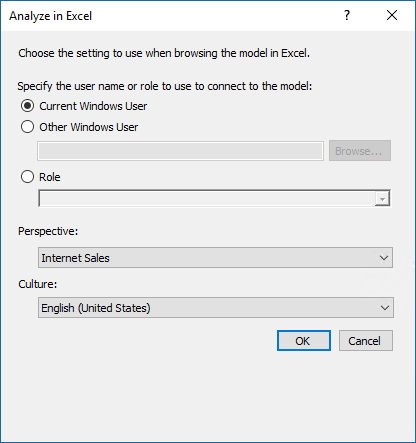
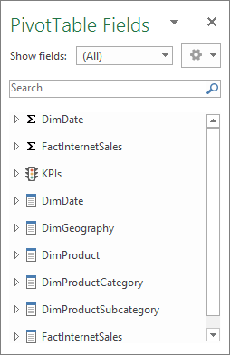

# Lesson 12: Analyze in Excel (1200 models)
[!INCLUDE[ssas-appliesto-sql2016-later-aas](../includes/ssas-appliesto-sql2016-later-aas.md)]

In this lesson, you will use the Analyze in Excel feature in SSDT to open Microsoft Excel, automatically create a data source connection to the model workspace, and automatically add a PivotTable to the worksheet. The Analyze in Excel feature is meant to provide a quick and easy way to test the efficacy of your model design prior to deploying your model. You will not perform any data analysis in this lesson. The purpose of this lesson is to familiarize you, the model author, with the tools you can use to test your model design. Unlike using the Analyze in Excel feature, which is meant for model authors, end-users will use client reporting applications like Excel or Power BI to connect to and browse deployed model data.  
  
In order to complete this lesson, Excel must be installed on the same computer as SSDT. To learn more, see [Analyze in Excel](../tabular-models/analyze-in-excel-ssas-tabular.md).  
  
Estimated time to complete this lesson: **20 minutes**  
  
## Prerequisites  
This topic is part of a tabular modeling tutorial, which should be completed in order. Before performing the tasks in this lesson, you should have completed the previous lesson: [Lesson 11: Create Roles](lesson-11-create-roles.md).  
  
## Browse using the Default and Internet Sales perspectives  
In these first tasks, you will browse your model by using both the default perspective, which includes all model objects, and also by using the Internet Sales perspective you earlier. The Internet Sales perspective excludes the Customer table object.  
  
#### To browse by using the Default perspective  
  
1.  Click the **Model** menu > **Analyze in Excel**.  
  
2.  In the **Analyze in Excel** dialog box, click **OK**.  
  
    Excel will open with a new workbook. A data source connection is created using the current user account and the Default perspective is used to define viewable fields. A PivotTable is automatically added to the worksheet.  
  
3.  In Excel, in the **PivotTable Field List**, notice the **DimDate** and **FactInternetSales** measure groups appear, as well as the **DimCustomer**, **DimDate**, **DimGeography**, **DimProduct**, **DimProductCategory**, **DimProductSubcategory**, and **FactInternetSales** tables with all of their respective columns appear.  
  
4.  Close Excel without saving the workbook.  
  
#### To browse by using the Internet Sales perspective  
  
1.  Click the **Model** menu, and then click **Analyze in Excel**.  
  
2.  In the **Analyze in Excel** dialog box, leave **Current Windows User** selected, then in the **Perspective** drop-down listbox, select **Internet Sales**, and then click **OK**. 
    
    
    
3.  In Excel, in **PivotTable Fields**, notice the DimCustomer table is excluded from the field list.  
    
    
    
4.  Close Excel without saving the workbook.  
  
## Browse by using roles  
Roles are an integral part of any tabular model. Without at least one role to which users are added as members, users will not be able to access and analyze data using your model. The Analyze in Excel feature provides a way for you to test the roles you have defined.  
  
#### To browse by using the Sales Manager user role  
  
1.  In SSDT, click the **Model** menu, and then click **Analyze in Excel**.  
  
2.  In the **Analyze in Excel** dialog box, in **Specify the user name or role to use to connect to the model**, select **Role**, and then in the drop-down listbox, select **Sales Manager**, and then click **OK**.  
  
    Excel will open with a new workbook. A PivotTable is automatically created. The Pivot Table Field List includes all of the data fields available in your new model.  
      
3.  Close Excel without saving the workbook.  
  
## What's next?
Go to the next lesson: [Lesson 13: Deploy](lesson-13-deploy.md).

  
  
  
