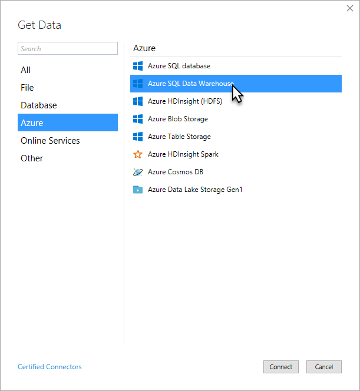
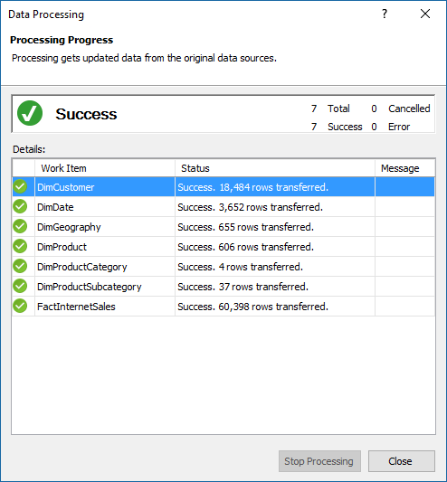

# Get data

[!INCLUDE[ssas-appliesto-sql2017-later-aas](../../includes/ssas-appliesto-sql2017-later-aas.md)]

In this lesson, you use **Get Data** to connect to the AdventureWorksDW sample database, select data, preview and filter, and then import into your model workspace.  
  
Under the hood, Get Data is Power Query, which provides a vast array of tools for connecting to and reshaping data for modeling and analysis. To learn more, see [Power Query Documentation](https://docs.microsoft.com/power-query/). 

> [!NOTE]
> Tasks and images in this tutorial show connecting to an AdventureWorksDW2014 database on an on-premises server. In some cases, an AdventureWorksDW database on Azure Synapse Analytics (SQL Data Warehouse) may show different objects; however, they are fundamentally the same.
  
Estimated time to complete this lesson: **10 minutes**  
  
## Prerequisites  

This article is part of a tabular modeling tutorial, which should be completed in order. Before performing the tasks in this lesson, you should have completed the previous lesson: [Lesson 1: Create a new tabular model project](../tutorial-tabular-1400/as-lesson-1-create-a-new-tabular-model-project.md).  
  
## Create a connection  
  
#### To create a connection to the AdventureWorksDW database  
  
1.  In **Tabular Model Explorer**, right-click **Data Sources** > **Import from Data Source**.  
  
    This launches **Get Data**, which guides you through connecting to a data source. If you don't see Tabular Model Explorer, in **Solution Explorer**, double-click **Model.bim** to open the model in the designer. 
    
    
  
2.  In Get Data, click **Database** > **SQL Server Database** > **Connect**.  
  
3.  In the **SQL Server Database** dialog, in **Server**, type the name of the server where you installed the AdventureWorksDW database, and then click **Connect**.  

4.  When prompted to enter credentials, you need to specify the credentials Analysis Services uses to connect to the data source when importing and processing data. In **Impersonation Mode**, select **Impersonate Account**, then enter credentials, and then click **Connect**. It's recommended you use an account where the password doesn't expire.

    
  
    > [!NOTE]  
    > Using a Windows user account and password provides the most secure method of connecting to a data source.
  
5.  In Navigator, select the **AdventureWorksDW** database, and then click **OK**. This creates the connection to the database. 
  
6.  In Navigator, select the check box for the following tables: **DimCustomer**, **DimDate**, **DimGeography**, **DimProduct**, **DimProductCategory**, **DimProductSubcategory**, and **FactInternetSales**. After selecting the tables, click **Edit**. 

    
  
After you click Edit, Query Editor opens. In the next section, you select only the data you want to import.

  
## Filter the table data  

Tables in the AdventureWorksDW sample database have data that isn't necessary to include in your model. When possible, you want to filter out unnecessary data to save in-memory space used by the model. You filter out some of the columns from tables so they're not imported into the workspace database, or the model database after it has been deployed. 
  
#### To filter the table data before importing  
  
1.  In Query Editor, select the **DimCustomer** table. A view of the DimCustomer table at the datasource (your AdventureWorksDW sample database) appears. 
  
2.  Multi-select (Ctrl + click) **SpanishEducation**, **FrenchEducation**, **SpanishOccupation**, **FrenchOccupation**, then right-click, and then click **Remove Columns**. 

    
  
    Since the values for these columns are not relevant to Internet sales analysis, there is no need to import these columns. Eliminating unnecessary columns makes your model smaller and more efficient.  

    > [!TIP]
    > If you make a mistake, you can backup by deleting a step in **APPLIED STEPS**.   
    
    

  
4.  Filter the remaining tables by removing the following columns in each table:  
    
    **DimDate**
    
      |Column|  
      |--------|  
      |**DateKey**|  
      |**SpanishDayNameOfWeek**|  
      |**FrenchDayNameOfWeek**|  
      |**SpanishMonthName**|  
      |**FrenchMonthName**|  
  
    **DimGeography**
  
      |Column|  
      |-------------|  
      |**SpanishCountryRegionName**|  
      |**FrenchCountryRegionName**|  
      |**IpAddressLocator**|  
  
    **DimProduct**
  
      |Column|  
      |-----------|  
      |**SpanishProductName**|  
      |**FrenchProductName**|  
      |**FrenchDescription**|  
      |**ChineseDescription**|  
      |**ArabicDescription**|  
      |**HebrewDescription**|  
      |**ThaiDescription**|  
      |**GermanDescription**|  
      |**JapaneseDescription**|  
      |**TurkishDescription**|  
  
    **DimProductCategory**
  
      |Column|  
      |--------------------|  
      |**SpanishProductCategoryName**|  
      |**FrenchProductCategoryName**|  
  
    **DimProductSubcategory**
  
      |Column|  
      |-----------------------|  
      |**SpanishProductSubcategoryName**|  
      |**FrenchProductSubcategoryName**|  
  
    **FactInternetSales**
  
      No columns removed.
  
## Import the selected tables and column data  

Now that you've previewed and filtered out unnecessary data, you can import the rest of the data you do want. The wizard imports the table data along with any relationships between tables. New tables and columns are created in the model and data that you filtered out is not be imported.  
  
#### To import the selected tables and column data  
  
1.  Review your selections. If everything looks okay, click **Import**. The Data Processing dialog shows the status of data being imported from your datasource into your workspace database.
  
     
  
2.  Click **Close**.  

  
## Save your model project  

It's important to frequently save your model project.  
  
#### To save the model project  
  
-   Click **File** > **Save All**.  
  
## What's next?

[Lesson 3: Mark as Date Table](../tutorial-tabular-1400/as-lesson-3-mark-as-date-table.md).

  
  
