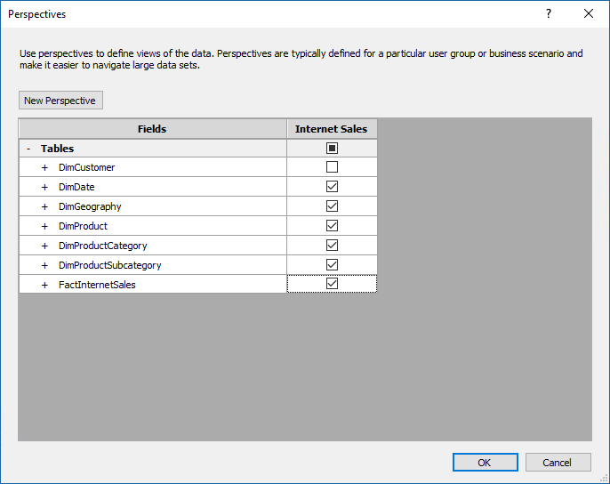

---
title: "Analysis Services tutorial lesson 8 Create perspectives | Microsoft Docs"
ms.date: 02/20/2020
ms.prod: sql
ms.technology: analysis-services
ms.custom: tabular-models
ms.topic: tutorial
ms.author: owend
ms.reviewer: owend
author: minewiskan
---
# Create perspectives

[!INCLUDE[ssas-appliesto-sql2019-later-aas-pbip](../../includes/ssas-appliesto-sql2019-later-aas-pbip.md)]

In this lesson, you create an Internet Sales perspective. A perspective defines a viewable subset of a model that provides focused, business-specific, or application-specific viewpoints. When a user connects to a model by using a perspective, they see only those model objects (tables, columns, measures, hierarchies, and KPIs) as fields defined in that perspective. To learn more, see [Perspectives](../tabular-models/perspectives-ssas-tabular.md).
  
The Internet Sales perspective you create in this lesson excludes the DimCustomer table object. When you create a perspective that excludes certain objects from view, that object still exists in the model, however, it's not visible in a reporting client field list. Calculated columns and measures either included in a perspective or not can still calculate from object data that is excluded.  
  
The purpose of this lesson is to describe how to create perspectives and become familiar with the tabular model authoring tools. If you later expand this model to include additional tables, you can create additional perspectives to define different viewpoints of the model, for example, Inventory and Sales.  
  
Estimated time to complete this lesson: **Five minutes**  
  
## Prerequisites  

This article is part of a tabular modeling tutorial, which should be completed in order. Before performing the tasks in this lesson, you should have completed the previous lesson: [Lesson 7: Create Key Performance Indicators](../tutorial-tabular-1400/as-lesson-7-create-key-performance-indicators.md).  
  
## Create perspectives  
  
#### To create an Internet Sales perspective  
  
1.  Click **Extensions** > **Model** > **Perspectives** > **Create and Manage**.  
  
2.  In the **Perspectives** dialog box, click **New Perspective**.  
  
3.  Double-click the **New Perspective** column heading, and then rename **Internet Sales**.  
  
4.  Select the all the tables *except* **DimCustomer**.  
  
    
  
    In a later lesson, you use the Analyze in Excel feature to test this perspective. The Excel PivotTable Fields List includes each table except the DimCustomer table.  

## Next step

[Lesson 9: Create hierarchies](../tutorial-tabular-1400/as-lesson-9-create-hierarchies.md)